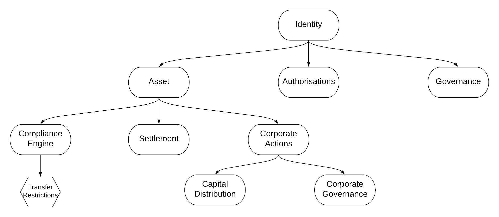

## Overview

The Polymesh blockchain is a optimised for regulated assets and markets. This is reflected in its approach to governance, security and consensus, as well as the base layer primitives provided directly by the network for asset management.

Polymesh is a public, permissioned blockchain. This means that anyone can run a node and check that the rules enforced by the network are being followed by all participants, and see all the public state secured by the blockchain, but that only certain entities (called operators) are allowed to run nodes that author new blocks, and vote on the finality of other blocks.

Polymesh provides core business logic and financial abstractions at its base layer, called primitives. These provide a rich set of embedded on-chain actions (called extrinsics) that a user can initiate, such as creating an asset, settling securities instructions or participating in on-chain governance.

Primitives can be extendable using constrained smart contracts called [smart extensions](./smart_extensions.md). These allow network users to take advantage of the standarisation and deep integration of the base layer primitives whilst facilitating complex custom logic, such as bespoke transfer restrictions.

Polymesh is built on the Substrate framework, an open-source project that provides a fully customisable, modular and extendable framework for blockchain developers. Polymesh has a native token, used for security and payments, [POLYX](./polyx.md).

## Architecture

[TODO - Add new diagram, description of layers]

## Polymesh Pillars

Polymesh is tailored to the needs of regulated assets and global capital markets. This approach is guided by the four key pillars of Polymesh - Identity, Governance, Confidentiality and Compliance.

### Identity

Identity is at the core of Polymesh. Polymesh implements a federated root of trust via permissioned Customer Due Diligence service providers. Every transaction in Polymesh is associated with an identity.

Identities provide private identity and key management. All users must act through an on-chain identity when interacting with Polymesh. Identities are referenced through DIDs (decentralised identifiers)

Identities allow asset issuers to enforce compliance on-chain and in real time as assets are issued, traded and settled between different parties.

An entity (a real world individual or organisation) can have multiple on-chain identities, allowing them to keep their overal positions confidential.

### Governance

Governance allows the chain to grow and develop. Polymesh has a sophisticated governance mechanism that combines signals from the broader community with technical experts (committees) and a governance council for actioning proposals. Polymesh Improvement Proposals (PIPs) can be proposed by any network user, and possible PIPs include network upgrades, setting the parameters of the network related to consensus and security and many other actions.

The Polymesh governance system is designed to further decentalise over time.

### Confidentiality

Privacy is at the heart of the Polymesh identity model, with confidential identity providing users the ability to keep their total positions obfuscated from observers. In future releases we will be integrating confidential assets into Polymesh, using the [MERCAT](https://info.polymath.network/hubfs/PDFs/Polymath-MERCAT-Whitepaper-Mediated-Encrypted-Reversible-SeCure-Asset-Transfers.pdf) protocol. 

### Compliance

Polymesh facilitates claim based compliance directly in its base layer. Asset issuers can set flexible and extendable rules relating to the claims that their investors are required to have attached to their identity in order to either send or receive the asset. These rules can be combined to create complex transfer restrictions that are tailored to the assets specific type, jurisidiction and regulatory regime. In addition, smart extensions allow asset issuers to author their own fully flexibly additional transfer restrictions, that can leverage the Polymath Unique Identity System to enforce compliance at the entity and identity level.