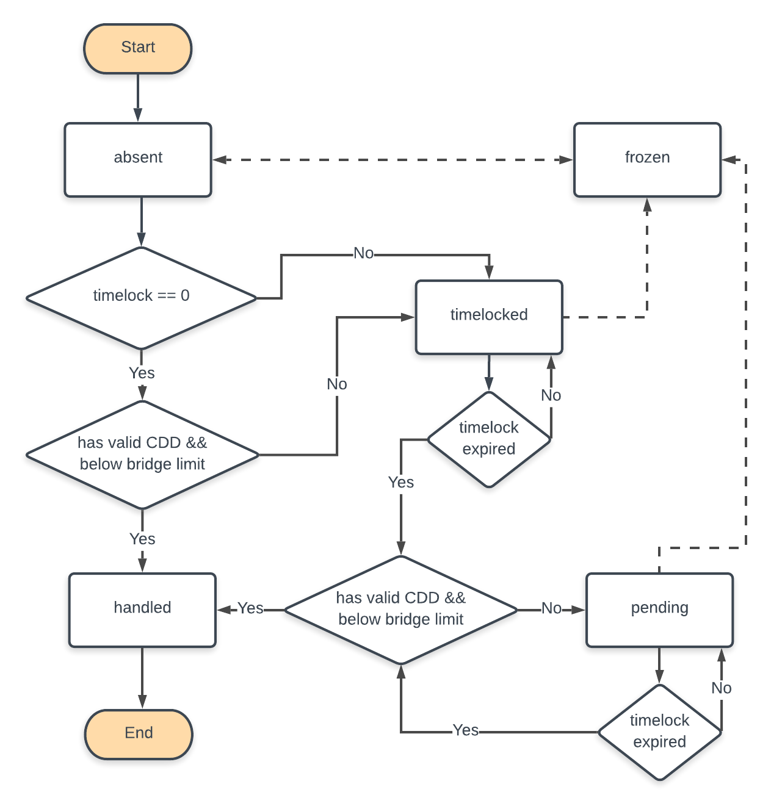

## Overview

The POLY to POLYX bridge allows ERC20 POLY tokens issued on the Ethereum mainnet, to be bridged on a 1-1 basis to Polymesh as POLYX native tokens.

Carrying the tokens over follows the standard *lock and mint* process. First, Ethereum tokens are locked indefinitely by an Ethereum smart contract. Then, native tokens are minted on the Polymesh side.

The bridge is a distributed system made up of the Ethereum smart contract, off-chain relay middleware and a dedicated Polymesh [runtime module](https://docs.polymesh.live/polymesh_runtime_common/bridge/index.html).

## Ethereum Locking Contract

Any POLY holder can lock their POLY. The smart contract only locks POLY and rejects any other tokens. In order to be locked, the amount must be greater than 1 POLY. There is no maximum on how much POLY can be locked. The granularity for locked POLY is restricted to that of the Polymesh chain, that is, 6 digits after the decimal period.

The user provides their Polymesh key address when locking POLY, however the contract does not check the validity of that address. Once the POLY is locked, the contract emits an event with the locked amount, the destination Polymesh address and the lock transaction hash.

The contract allows meta-transactions so that third parties such as exchanges can act on users' behalf. The smart contract is currently upgradable on the testnet.

## Relayer Middleware

Lock events emitted by the Ethereum POLY locker contract are listened to by *relayer* processes and verified by a sufficient amount of block confirmations. Each relayer process extracts Ethereum lock transactions from the received events and requests a connected *signer* process to sign those transactions before proposing thus signed transactions to the on-chain Polymesh bridge multisig, more details below.

Each signer has a Polymesh address which is registered in the bridge multisig wallet. This way the signers act as multisig voters. However the signers' role is only to passively sign the incoming transactions. It is the responsibility of the relayers to submit the signers' votes to the Polymesh chain.

## Polymesh Runtime Module

Minting of POLYX tokens is implemented in the Polymesh runtime, in the bridge pallet. Below is the state machine diagram for the lifecycle of a bridge transaction arriving at Polymesh from the bridge relayers. There are 5 states: absent, timelocked, pending, handled and frozen. Any successful transaction makes its way from absent (start) to handled (end). The solid arrows correspond to automated transitions according to the business logic. The dashed arrows correspond to manual actions of the bridge administrator. The administrator has the ability to freeze a transaction that is still in progress. This is however an exceptional measure only to allow for the human to stay in the loop. It is supposed to be exercised only in extreme cases.

Relayers are members of the bridge multisig account owned by the *bridge controller*. On the testnet, the number of relayers at genesis is 5. To start handling a transaction -- that is to change its status from absent -- at least 3 out of 5 relayers have to propose that same transaction.

Even though there is no maximum limit of how much POLY can be bridged, the Alcyone testnet side sets a limit on how much POLY is bridged per unit of time. There is going to be no such a limit on the mainnet.

## State Diagram

