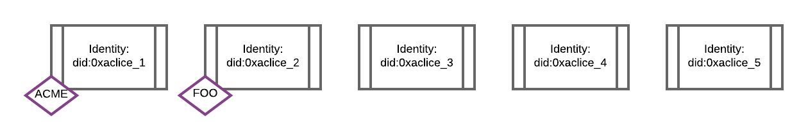
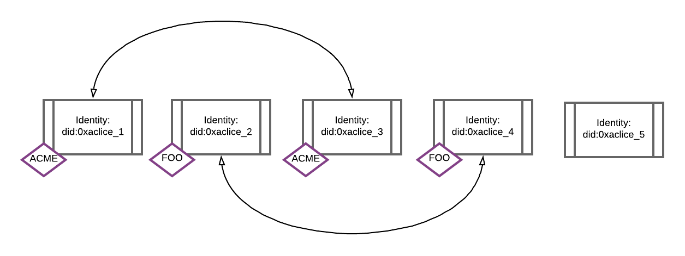
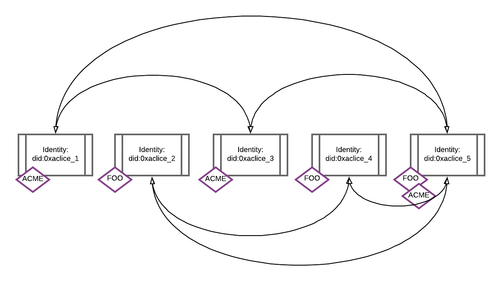

## Overview

A real-world person or organisation (entity) can have multiple identities. 

This means that a Polymesh user can retain privacy around their overall asset portfolio, by storing those assets across several identities that they own.

However, it is useful to be able to enforce a Sybil protection mechanism where a single entity must declare that one or more of their identities are linked, in order to take some action on the network, such as invest in an asset.

Polymesh uses a combination of cryptographic techniques to enforce this property - allowing users to own several unlinkable identities, whilst also allowing them to provably link them with respect to a specific scope (e.g. investing in a particular asset).

## Polymath Unique Identity System

The Polymath Unique Identity System (PUIS) is responsible for issuing every entity a unique identifier (entity ID). Regardless of which CDD service provider a user or organisation on-boards with, the CDD service provider will always interact with the PUIS to claim a new entity ID if the user is new to the network, or if they are an existing user verify their existing entity ID.

## Customer Due Diligence Claims

The entity ID is not directly written to Polymesh as part of the CDD claim as this would allow a public observer to always be able to link together accounts owned by the same entity (and hence having the same entity ID).

Instead we take a [Pedersen hash](https://en.wikipedia.org/wiki/Commitment_scheme) of this entity ID, plus some randomising factors, and add this commitment to the users CDD claim. This means that two identities, whilst being linked via a commitment to the same entity ID, cannot be linked together without knowledge of the entity ID.

## Scope Claims

Whilst this Pedersen commitment does not reveal linkage between a users identities, it means that the user can self-declare that two identities are linked. This aids compliance when trading regulated assets, as well as being a general purpose Sybil protection measure that layer 2 protocols built on top of Polymesh can leverage.

For example, if an asset issuer needs to track their total number of investors for compliance reasons, they can enforce that all of their investors declare whether or not they are using multiple identities to invest in their asset.

Declaring linkage is done by a user adding a self-issued Scope Claim to their identity. This claim is generated using their private knowledge of their entity ID, as well as the publiclly known commitment to this entity ID stored on-chain. This novel technique allows a user to partially link together their identities, and in particular only link together those identities that are needed to fulfil the asset issuers requirements (i.e. those identities that have invested in a particular asset).

For example, suppose that Alice has 5 identities, `0xalice_1`, `0xalice_2`, `0xalice_3`, `0xalice_4`, `0xalice_5` and wants to invest in two assets, ACME and FOO.

The issuers of both ACME and FOO are enforcing that their investors declare linkage within the scope of their asset tickers.

## No Linkage

Alice can choose to only use a single identity to invest in each of ACME and FOO. This means that none of her identities are publically linked.

## Partial Linkage

If Alice wants to use two separate identities to invest in each of ACME and FOO, then those identities will be publically linked (so that the ACME and FOO asset issuers can accurately track their total number of investors at the entity granularity).

## Full Linkage

If Alice were to use one of her identities to invest in both ACME and FOO, then that would link together all of her other identities.

