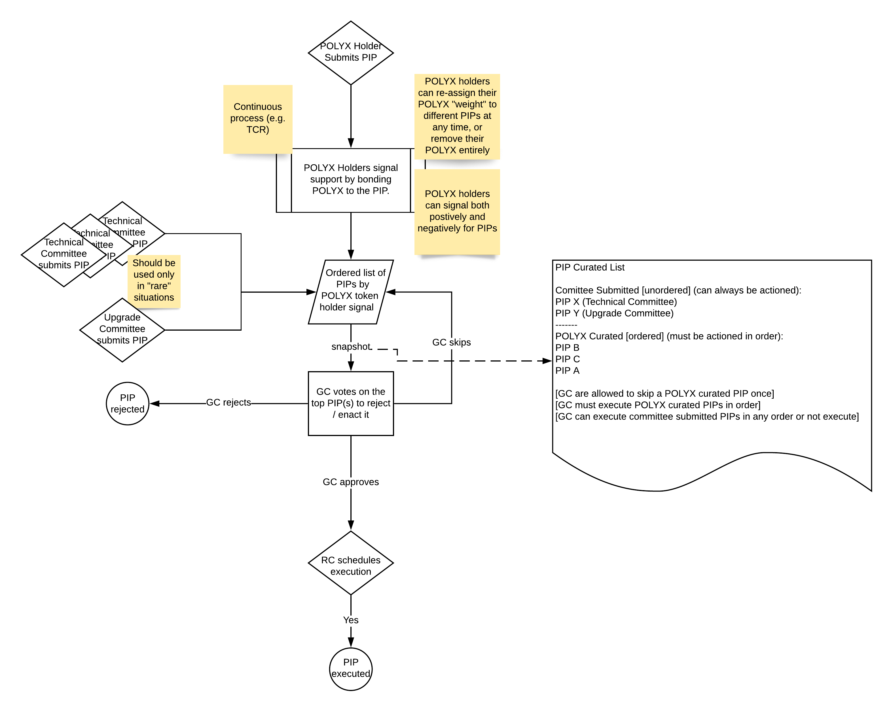

# Governance Overview

Polymesh includes on-chain governance to manage network upgrades, changing parameters of the network (e.g. slashing percentages), permissioning network roles and distributing treasury funds.

The governance system is designed to allow both community members and technical experts to collaborate on improving Polymesh and managing network changes.

There are three main groups of actors in Polymesh governance:  
- POLYX token holders  
_ Committees (e.g. Technical Committee, Upgrade Committee)  
- Governance Council  

The governance process begins either via a community submitted proposal, which is then curated by other POLYX token holders, or a committee submitted proposal. In both cases the governance council is responsible for accessing the change and determining whether it should be ratified, rejected or temporarily skipped.

The governance system consists of POLYX token holders populating and curating a list of PIPs ordered by their importance to the community. The governance council will then consider this list of PIPs, in their curated order, on a periodic basis (e.g. once per month), ratifying, rejecting or skipping each PIP in order as appropriate.

In addition to the Governance Council there are other committees (e.g. Technical Committee) that can submit PIPs directly to the Governance Council for review, bypassing the community curation process. However generally we expect most PIPs to go through the usual flow of the community curation process, and for direct committee submitted proposals to be rare.

