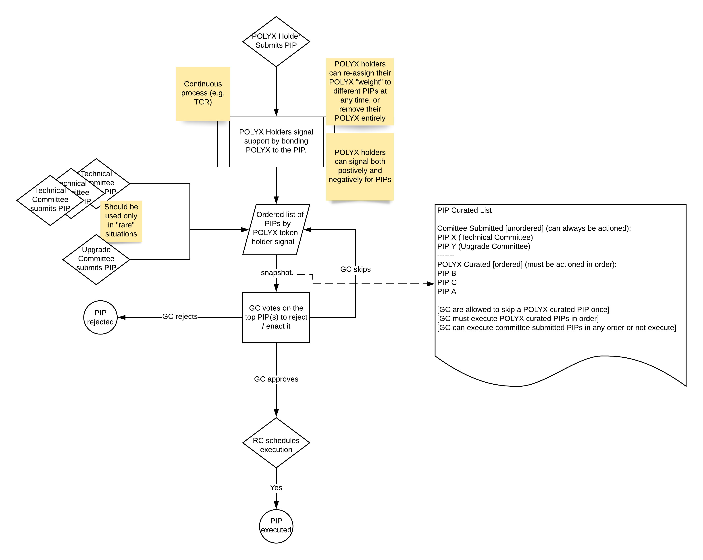

## Overview

Polymesh includes on-chain governance to manage network upgrades, changing parameters of the network (e.g. slashing percentages), permissioning network roles and distributing treasury funds.

The governance system is designed to allow both community members and technical experts to collaborate on improving Polymesh and managing network changes.

There are three main groups of actors in Polymesh governance:  

- POLYX token holders  

- Committees (e.g. Technical Committee, Upgrade Committee)  

- Governance Council  

The governance process begins either via a community submitted proposal, which is then curated by other POLYX token holders, or a committee submitted proposal. In both cases the governance council is responsible for accessing the change and determining whether it should be ratified, rejected or temporarily skipped.

The governance system consists of POLYX token holders populating and curating a list of PIPs ordered by their importance to the community. The governance council will then consider this list of PIPs, in their curated order, on a periodic basis (e.g. once per month), ratifying, rejecting or skipping each PIP in order as appropriate.

In addition to the Governance Council there are other committees (e.g. Technical Committee) that can submit PIPs directly to the Governance Council for review, bypassing the community curation process. However generally we expect most PIPs to go through the usual flow of the community curation process, and for direct committee submitted proposals to be rare.

## Governance Flow Diagram

## Polymesh Improvement Proposals

Polymesh Improvement Proposals (PIPs) represent an on-chain action that the community or a committee is recomending to the Governance Council.

Polymesh Improvement Proposals (PIPs) represent any of change to the network, and can be created both by dedicated committees as well as any POLYX token holder and are actioned by the Governance Council.

A PIP is an on-chain dispatchable function w/ parameters alongside some metadata giving some additional context as to why the function should be called. For example, it may be a call to `system::set_code(new_binary)` which is linked to a Github PR describing the change.

These PIP dispatchables can only be executed by the Governance Council and not an individual user.

PIPs are also used to permission certain on-chain identities to have special priviledged roles. This includes adding and removing permissioned operators and CDD service providers.

Some common examples include:  

- network upgrades (represented as a call to system::set_code TODO: add link) 

- treasury disbursement

- tokenomics parameter change

- adding new permissioned operators

- adding new permissioned CDD service providers

## Signalling

It is important that PIPs are curated by community members (POLYX token holders) to provide feedback to the Governance Council on the relative importance to the community of different PIPs.

Any POLYX token holder, in addition to being able to submit a PIP for consideration, can signal their view on other community submitted PIPS, both postiviely or negatively, by bonding POLYX to the relevant PIP. The POLYX token holders signal is proportional to the amount of POLYX bonded by that community member.

When the Governance Council triggers a PIP snapshot, we take these signals and use them to order the community submitted PIPs for consideration by the Governance Council.

Currently we take a linear count of positive and negative signals and use these to order PIPs, but in the future we can consider more expressive mechanisms, such as quadratic voting by leveraging our confidential identity model (TODO: Link).

Token holders can unbond their POLYX and remove their support (or lack of support) from a PIP at any time. Bonding POLYX to signal on different PIPs does not prevent token holders from staking their POLYX.

## Committees

Polymesh governance includes committees. Each committee is a group of identities which a specific remit to manage certain types of network changes.

Each committee has a membership, with the current members being responsible for voted new members in or existing members out.

Associated with each committee is a voting threshold - for example, if the committee has 5 members, and a threshold of 50%, then at least 3 members of the committee must agree on an action before it is executed by the committee.

Committees can submit PIPs which are included are then put in front of the Goverance Council for consideration. The Governance Council can choose to ratify, reject or ignore a committee submitted PIP.

Unlike community submitted PIPs, a committee submitted PIP is not subject to signalling from the community of POLYX token holders, and is always eligable for actioning by the Governance Council.

## Governance Council

The Polymesh Governance Council is ultimately responsible for actioning PIPs which were submitted either via the community curation process, or directly by one of the committees.

Any member of the governance council can trigger a PIP snapshot. The snapshot summarises the current list of PIPs (both from the community and committees) and orders community based PIPs based on their signal.

The Governance Council then meet to discuss the PIPs included in the snapshot. For community currated PIPs, the Governance Council must work through them based on their curated order, choosing whether to ratify, reject or skip each PIP in turn.

For PIPs which are skipped, we track how many times they have been skipped, and limit the Governance Council to skipping a particular PIP too many times. This is designed to give the Governance Council the flexibility they need to reasonable govern the evolution of the Polymesh network, as well as ensuring that community signalling of the relative importance of PIPs is closely considered by the Governance Council.

For PIPs submitted by committees rather than through the community curation process, the Governance Council is free to ratify or reject these PIPs in any order.

The Governance Concil can be thought of as a multisig controlled by its members, and has an associated voting threshold that must be reached in order to execute an action through the Governance Council. This applies both for PIP management as well as some additional non-PIP related actions that the Governance Council may need to execute.

These non-PIP actions include managing the membership of the Governance Council itself, with existing members needing to agree and vote on the addition or removal of members, as well as changes to the voting structure, for example the voting threshold.

The Goverance Council is also able to issue a Customer Due Diligence claim (TODO: add link) should the need arise.

## Release Coordinator

One member of the Governance Council is elected as the Release Coordinator. The role of the Release Coordinator is to schedule PIPs that have been ratified by the Governance Council.

Every ratified PIP has a default execution time, set as a specific amount of blocks from the time it was ratified. The Release Coordinator can re-schedule any PIP to a different execution block or choose to enact it immediately. This provides flexibility to coordinate the release of critical fixes, and ensure that any stakeholders in a particular PIP are coordinated and well prepared before the PIP is executed.