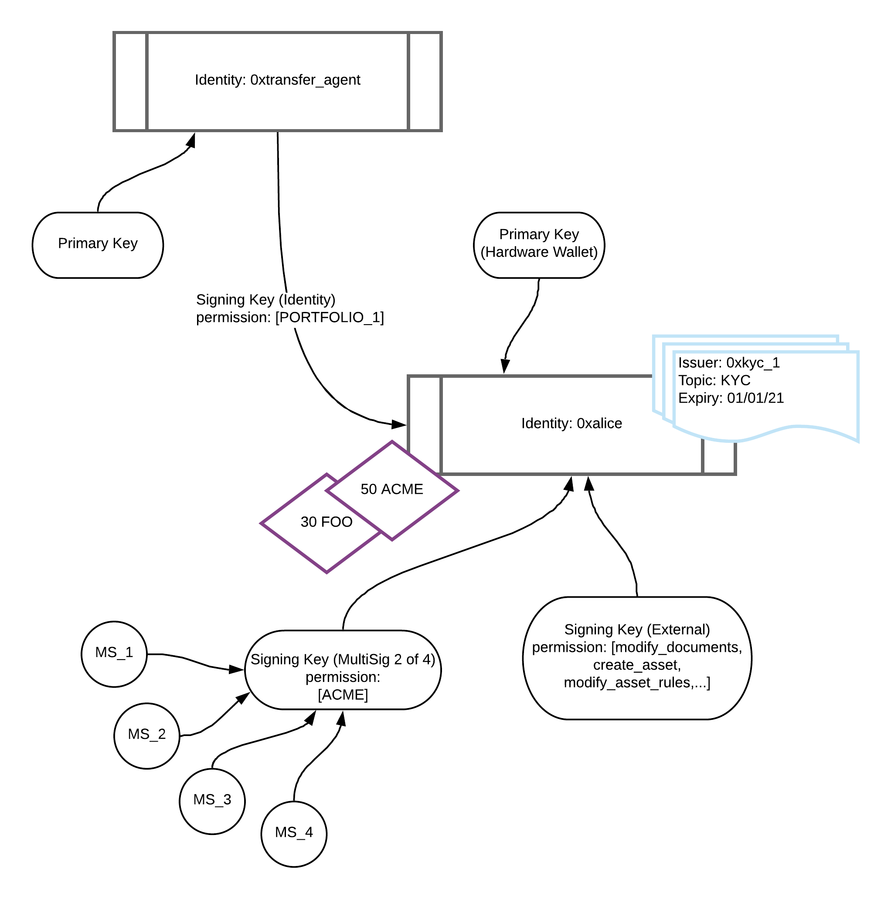

## Overview

Identity is at the core of Polymesh.

To submit a transaction on-chain, the signing key of that transaction must be associated with an identity or authorising an action on behalf of an identity.

Polymesh implements a federated root of trust via permissioned Customer Due Diligence service providers. Every transaction in Polymesh is associated with an identity.

Identities in Polymesh are controlled via keys - each identity must have a single primary key and can optionally have additional secondary keys.

Identities are a collection of claims and assets and controlled via keys.

A user can have multiple identities, which provide for confidential identity whilst allowing asset issuers to enforce entity level compliance.

Each identity is referenced via a decentralised identifier - its DID. A DID is a pseudo-anonymous identifier such as `0xfc0d2fc058d02c0a89c2cc2ff11726971dd39886a0b80ecfaa80fa3f196d65ce`.

## Identity Diagram

## Assets

Assets held by a user are associated with one of their identities. For example the identity with DID `0xabc` might have a balance of 50 ACME tokens and 30 FOO tokens.

Assets held by an identity can be organised into [portfolios](./portfolios_custody.md) beneath that identity.

## Claims

An identity can add a claim to another identity, and in turn holds claims that have been added to it by other identities.

To enforce compliance on their assets, asset issuers nominate trusted claim issuers to manage their investors claims related to their assets compliance rules.

## Authentication and Keys

Identities are created for users by [CDD service providers](./cdd.md).

Unlike most blockchains, in Polymesh all on-chain actions are associated both with a signing key (the key used to sign the transaction) and an on-chain identity.

To facilitate this connection between identities and signing keys, each on-chain identity is associated with keys which are allowed to sign on its behalf. A given key can only be associated with at most one identity at any one time.

These keys are known either as primary keys or secondary keys.

POLYX, the native token of Polymesh, is held at the key level. Staking and governance, both of which utilise POLYX, is also associated with keys. In both cases, although balances are held at the key level, any transaction involving POLYX must be associated with an identity that has a valid CDD claim.

## Primary and Secondary Keys

An identity is associated with a primary key on creation by the CDD service provider. This key is typically the public half of a public / private key pair held by the user owning the identity.

The primary key of an identity has full permissions to that identity and can add and remove additional secondary keys.

A secondary key can also sign transactions on behalf of its identity, but can have its permissions limited to only certain actions, portfolios or assets. It can also be removed by the primary key of its identity at any time.

For more information on our public / private key cryptography please see:
<https://substrate.dev/docs/en/knowledgebase/advanced/cryptography>

## Key Types

There are three types of keys that can be used in Polymesh:  

- Public / Private key pairs

- Multisigs

- Other identities

Polymesh is generally agnostic as to the type of key being used, and treats each key type consistently (e.g. for permissioning).

### Public / Private Key Pairs

Polymesh uses public-key cryptography based on the [Ed25519](https://substrate.dev/docs/en/knowledgebase/advanced/cryptography#ed25519) curve, and allows keys that use either the Ed25519 or SR25519 constructions.

These types of keys can be held on hardware wallets, or can be generated off-line and stored as paper wallets.

### Multisigs

In addition to public / private key pairs a key can also be a multisig account.

A multisig is a single key which is controlled by one or more people. A *n* of *m* multisig requires *n* of its *m* members to agree on an action, before that action can be signed by that multisig.

- MultiSig Signers: the keys attached to the MultiSig as signers

- Creator Identity: the identity that created the MultiSig - this is fixed and can't be modified

- Acting Identity: the identity that the MultiSig acts through, by virtue of being attached as a Signing / Master Key.

- MultiSig Signers => MultiSig is mapped through `KeyToMultiSig`

- MultiSig => Creator Identity is mapped through `MultiSigToIdentity`

- MultiSig => Acting Identity is mapped through `KeyToIdentityIds` (None if MultiSig is not a Primary / Secondary Key)

This has the consequence that MultiSig Signers can not send / receive POLYX (since they are not directly associated with an identity).

MultiSigs can hold funds, once they have been attached as a Primary / Secondary Key to an identity. If they are removed from the identity they can continue to hold funds, as per normal external key behaviour, but these funds are locked until the key is reattached to a CDD'ed identity.

All transactions have a single payer, which is established when the transaction is first submitted. For a transaction executed via a MultiSig this will be the Creator Identity derived from the external MultiSig Signer account that submits the extrinsic.

When Signers are approving / proposing a MultiSig transaction, we have:

- CDD check done on Creator Identity

- Payment made by Creator Identity

When a MultiSig executes a proposal, we have:

- CDD check done on Creator Identity

- CDD check done on Acting Identity (on dispatch)

- Payment made by Creator Identity

### Identity Keys

To allow flexible identity modelling of indiviudals, organisations and different types of cooperating stakeholders, Polymesh allows one identity to act as a key for another identity. This means the origin identity is attached as a secondary key to the acting identiy.

An appropriately permissioned key on the origin can sign a message on behalf of the origin identity to forward an action through the acting identity. For example Acme could add their transfer agents identity as a secondary key on their identity, with limited permissions to only add or remove documentation for certain assets.

## Permissions

Permissions in Polymesh have three levels of granularity, that can be combined:  

- actions

- portfolios

- assets

The *actions* granularity allows a key to be permissioned to specific on-chain actions, such as submitting documentation for an asset, or signalling in governance.

The *portfolios* granularity allows a key to be limited to interacting with only those assets in specific portfolios under that identity.

The *assets* granularity allows a key to be limited to interacting with only specific assets held in any portfolio under the identity.

The access of a particular key is the intersection of each of these categories. It is possible to permission a key with full access to any of these categories.