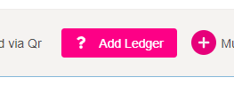
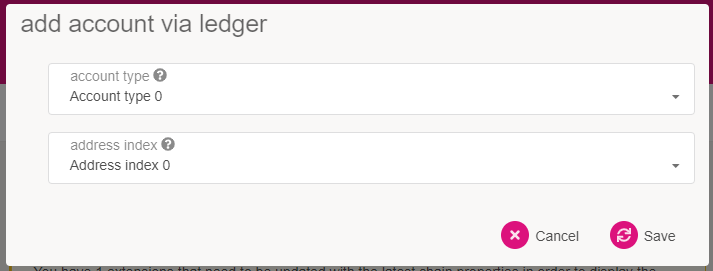
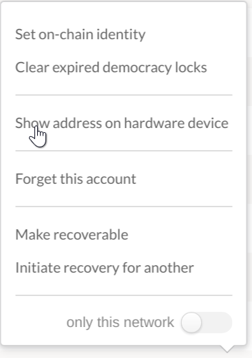

NB - the Ledger App is currently being reviewed and is not yet available in the Ledger Live App Store.

## Overview

> Note: Because of required WebUSB support, Ledger wallets currently only work on Chromium-based
> browsers like Brave and Chrome.

The Polymesh [Ledger][] application is compatible with both the Ledger Nano S and the Ledger Nano X devices. Ledger devices are hardware wallets that keep your secret secured on a physical device that does not expose it to your computer or the internet.

The Polymesh Ledger application allows you to manage Polymesh's native token, POLYX and interact with the Polymesh blockchain. It supports most of the transaction types of the network, although the initial version does not support batched transactions (see utility pallet).

## Requirements

Here is a list of what you will need before starting:

- A Ledger Nano S or a Ledger Nano X.
- The latest firmware installed (at the time of writing this is 1.6.1 on the Nano S, and 1.2.4-4 on
  the Nano X).
- Ledger Live is installed and at version 2.1 or newer (see settings -> about to find out if you're
  up to date).
- A Chromium-based web browser is installed that you can use to access the [Polymesh App](https://app.polymesh.live/#/explorer).

## Installing the Ledger Application

### Using Ledger Live

- Open the "Manager" tab in Ledger Live.
- Connect and unlock your Ledger device.
- If asked, allow the manager on your device by pressing both buttons on the YES screen.
- Find Polymesh in the app catalog and install it.

## Using on the Polymesh App

### Loading Your Account

The [Polymesh App](https://app.polymesh.live/#/accounts) already has an integration with the Ledger application so that your device will work with the browser interface after installation. 

The functionality is currently gated behind a feature setting that you will need to turn on.

In order to turn on the interoperability with the Polymesh Ledger application, go to the "Settings" tab in the Polymesh App. Find the option for attaching Ledger devices and switch the option from the default "Do not attach Ledger devices" to "Attach Ledger via WebUSB".

Click "Save" to keep your settings.

For the next step, your Ledger device must be attached to your computer, and the Ledger Live app must be closed.

Now when you go to the "Accounts" tab you will see a new button that says "Add Ledger". Ensure that
your Ledger device is unlocked and you have navigated into the Polymesh application, then click this
button.

A popup will appear asking you to select an account and derivation path.

The first option lets you select an account. You can have multiple accounts on a single Ledger device. The second dropdown lets you pick a derivation path - think of it like a formula from which child accounts are generated. If in doubt, pick the first option for both. 0 / 0 is a good default.

Once you confirm your selection, depending on your browser and its security settings, you might need to confirm the USB connection through a popup like the one below when adding the Ledger device for the first time:

Click on the "Unknown device" line and the "Connect" button will become available.

You should now be able to scroll down and find a new account on the page with the type "ledger".

You can now use this account to interact with Polymesh on Polymesh App and it will prompt your ledger for confirmation when you initiate a transaction.

### Confirming the Address on your Device

On the "Accounts" tab, find your Ledger-connected account. Click on the three vertical dots at the end of the row. This will open a new menu, here you can click the "Show address on hardware device" option to display the address on your device.

Here you can scroll through and make sure the address matches to what is displayed on the Polymesh App.

#### Using the Polymesh App

Once you have your account loaded on the "Accounts" tab it should show a row with your Ledger account. At the far right of the row is located your account's POLYX balance. If you expand the balance arrow, it will show details of your balance such as locks or reserved amounts.

If you select your Ledger account when submitting an extrinsic, you will be prompted to sign the transaction on your Ledger. The Leger device must be attached when submitting an extrinsic from your Ledger account.

## Support

For support, please contact [Polymath](https://polymath.network/).

For code, please see [Releases Page](https://github.com/Zondax/ledger-polymesh/releases).