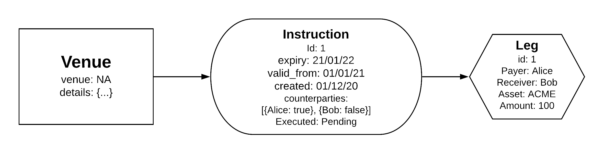
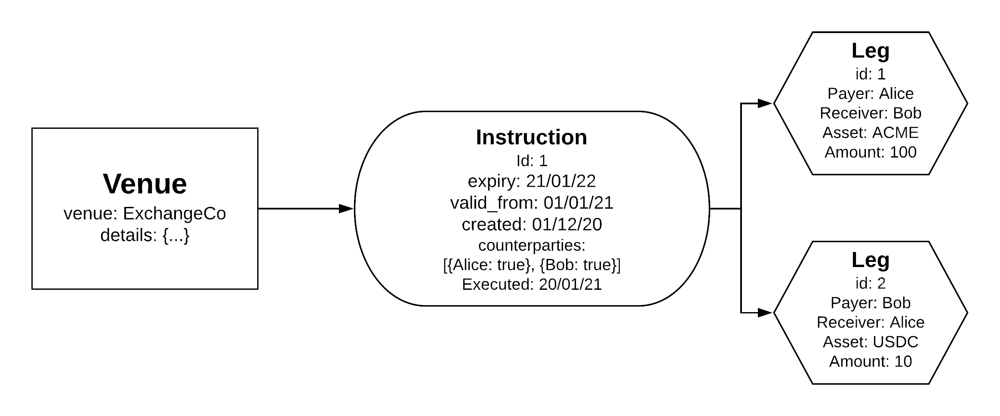
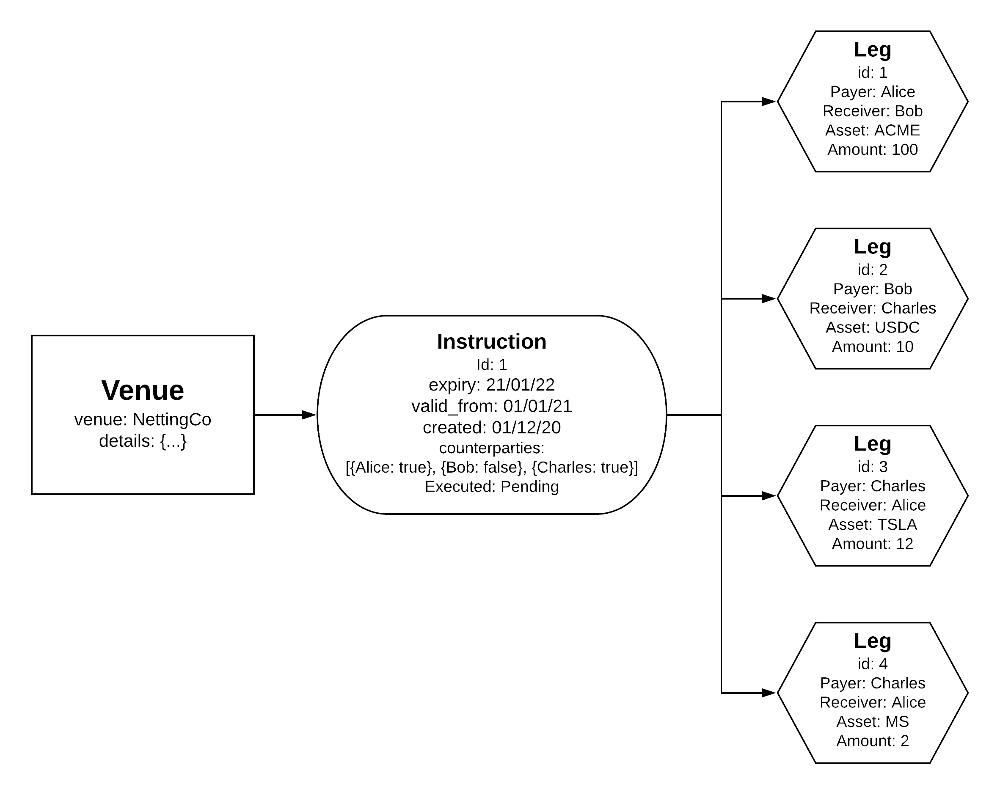
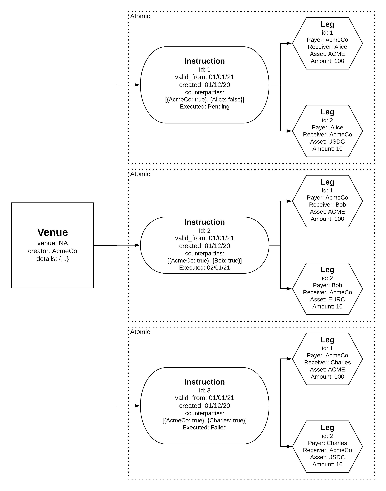

## Roles

### Asset Issuer

The asset issuer controls the set of identities that are allowed to create instructions that reference their asset. They can also choose to leave this open.

### Venue Creator

Only the creator of a venue is allowed to create instructions underneath it.

The creator of a venue can cancel any pending instruction underneath it.

The venue creator controls the set of identities that are allowed to sign payment receipts for instructions underneath it.

### Counterparty

A counterparty is relative to an instruction, and is any identity that is referenced as a payer / receiver in a leg within that instruction.

Each counterparty must authorise any instruction where they appear as a counterparty, before the instruction can settle.

Authorisation can be via an on-chain transaction, or signed data.

Once an instruction is authorised by a counterparty, their assets are locked, and the instruction will settle once all counterparties have authorised.

A counterparty can cancel a pending instruction. If any counterparty cancels, the entire instruction should be marked as cancelled (and everyones assets unlocked).

## Peer to Peer Transfer

Alice wants to transfer 10 ACME tokens to Bob as a gift.

She uses her “default” venue (or any venue that she has previously created) to generate an instruction, with a single leg.

If Bob has provided pre-authorisation via signed data to Alice, she can submit it alongside the transaction as Bobs authorisation, and her own authorisation is implicit (since she is creating the instruction). Alices ACME tokens are locked until Bob authorises the instruction (or Alice cancels), assuming he has not pre-authorised.

Once the instruction has been fully authorised (which can happen upon creation if pre-authorised) it settles with Bob receiving 10 ACME tokens.

## Exchange Mediated Transfer

ExchangeCo matches Alice, a seller of ACME, with Bob, a buyer of ACME, and coordinates an agreed price to exchange assets - 100 ACME for 10 USDC.

ExchangeCo creates a venue, adds a single instruction, with two legs, and an expiry time of T + 1 hour.

Bob authorises the instruction, locking 10 USDC.

Alice authorises the instruction, locking 100 ACME.

The instruction is executed with Alice receiving 10 USDC and Bob receiving 100 ACME.

## Exchange Mediated Transfer with Authorisation

ExchangeCo matches Alice, a seller of ACME, with Bob, a buyer of ACME, and coordinates an agreed price to exchange assets - 100 ACME for 10 USDC.

ExchangeCo collects a signed authorisation from Alice and Bob indicating that they agree a specific instruction.

Bob’s authorisation includes a signed receipt that he has transferred funds to Alice, meaning that no additional funds are locked from Bob into the instruction, and instead his receipt signed data is marked as locked.

ExchangeCo creates a venue, with a single instruction with two legs, providing the authorisation data from Alice and Bob.

The instruction is authorised upon creation, and immediately settles, transferring 100 ACME from Alice to Bob and marking Bob’s receipt as used.

## Netting Process

ClearCo, with a pre-agreed netting contract with BankCo’s, collects trade data from BankCo_1, BankCo_2, BankCo_3 and BankCo_4 and calculates an optimal netting strategy.

ClearCo creates a venue with an instruction containing four legs representing the netting trades between BankCo’s and an expiry time of T + 24 hours.

Each BankCo individually authorises the instruction - when all BankCo’s have authorised the netting settlement is automatically executed.

## Security Token Offering

AcmeCo wishes to distribute 1000 ACME tokens to investors.

AcmeCo creates a Venue defining the start and end date of their issuance.

Alice provides AcmeCo with an authorisation to buy 100 ACME tokens at 10 USDC (i.e. an authorisation for an instruction with these two legs).

AcmeCo creates an instruction under their settlement passing along Alice’s authorisation, along with their own. The instruction is executed with Alice receiving her ACME tokens, and AcmeCo receiving their assets.

